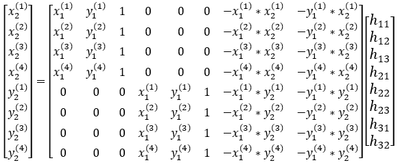

# ImageStitching

This project was developed for the Computer Vision course. The objective is to build a single panoramic image from a sequence of overlapping images in Matlab. For example, from the following sequence of five overlapping images:


we obtain the following panoramic image:


## Approach

The project was divided in two scripts: **homog.m** which consists of a function responsible for returning the projective transformation (i.e., homography) between each image and the reference image (i.e., first image) and **run.m** which calls the previous function and composes the single panoramic image based on the homographies.

To obtain the homographies, the script **homog.m** performs the following steps:

**Feature matching:** First, the SURF features of each consecutive pair of images (by using native Matlab methods) are matched by means of the Nearest Neighbour method. These matches represent keypoints that are common to the pair of images and are going to be used to obtain the projective transformation between them.

**Outlier rejection:** Usually, some matches are wrong (known as outliers) as one can see in the next image which contains 3 outliers highlighted with a red rectangle:


To remove the outliers, a method called RANSAC is performed. This method has the following steps:
1) Randomly select the minimum number of matches (pair of points) needed for the transformation
2) Estimate the parameters of the model based on those matches
3) Using the remaining matches and the model obtained in step 2, determine the transformation for each match point and calculate the error
4) Count the number of matches whose error is inferior to a given threshold (these points are known as inliers)
5) Repeat all formers steps for a given number of iterations and choose the matches that correspond to the highest number of inliers

For a 2D projective transformation (i.e., homography), the minimum number of points (for step 1) is 4, as it will be explained below. After applying RANSAC, the 3 ouliers are removed:


**Obtain transformations**: An homography corresponds to a 3x3 matrix where the value in the 3rd column and 3rd row (i.e., in position (3,3)) corresponds to a scale factor to which the value 1 can be assigned. Therefore, the degree of freedom (i.e., the number of parameters) is 3x3-1 = 8. As each match point gives 2 coordinates (x and y), the minimum number of points needed to obtain the matrix is 8/2 = 4. Given the matches between images, the homography matrix can be obtained by applying a Direct Linear Transformation (DLT). 

So, a 2D homography can be rewritten as:


Therefore, for the minimum number of points (i.e., 4), the DLT is:



For more than 4 points, the Least Square method must be applied. That corresponds to solving the DLT with the following normal equation:


where h is the vector of parameters, A is the square matrix and B is the vector of coordinates of the second image.

**Propagate transformations**: The projective transformations are calculated between consecutive images (i.e., H12 for homography between images 1 and 2, H23 for homography between images 2 and 3, etc). To obtain the transformations between each image and the reference image (which in this case is the image 1), the transformations must be propagated (i.e., multiplied) from the given image to image 1. For instance, to obtain the transformation from image 3 to image 1:

```
H31 = H21 * H32
```

Note that to obtain, for example, H21, we simply apply the inverse of H12 (which is the one we actually obtain from the previous step).

## To run the program

To test the program, simply execute the file **run.m** in Matlab. This script reads the images from a chosen dataset, calls the function on the script **homog.m** and uses the resulting homographies to build the mosaic.

To select a dataset, edit the line 8 of the file **run.m**. For example, to use the "translation" dataset:

```
folder_name = 'datasets/translation/';
```

To change the RANSAC parameters, edit the lines 43-45 of the file **homog.m**

```
threshold = 49; %set threshold (|r_i|<epsilon) - inlier criteria
bigP = 0.99; %probability of success after k tries
smallP = 0.28; %fraction of matches that are inliers - pessimistic assumption
```